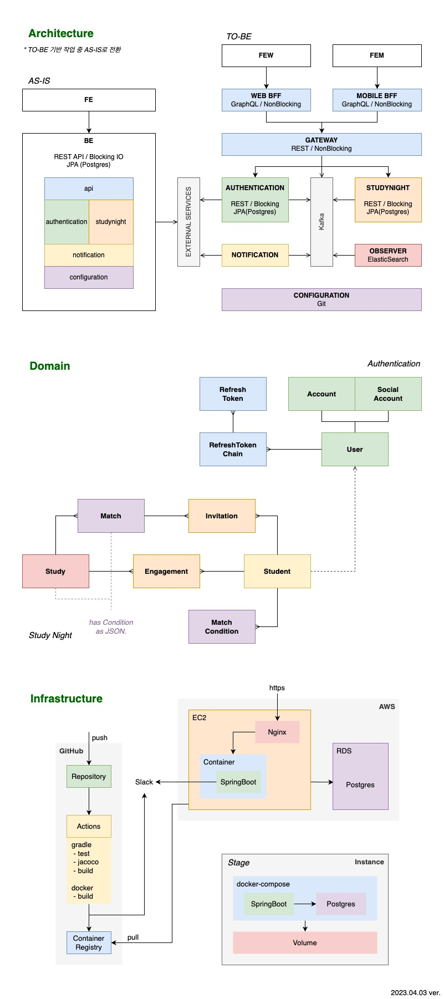

# StudyNight Backend

개발자 스터디 매칭 서비스

- [API](#API)
- [DNS](#DNS)
- [RUN](#RUN)
- [CI](#CI)
- [DIAGRAM](#DIAGRAM)

---

## API

[SWAGGER](http://localhost:8080/swagger-ui.html) (운영 전까지는 로컬에서 `stage` 프로파일로 실행 후 접근해주세요.)

---

## DNS

### FE

> local: http://localhost:3000  
> stage: 가변. BE `application.yml`의 `cors.allowed-origin` 변경 필요.  
> live : https://www.DOMAIN

### BE

> local: http://localhost:8080   
> stage: 가변.  
> live : https://api.DOMAIN

---

## RUN

`.env/$profile/`

> 환경변수 `$HAPPYNEWYEAR_HOME`에 프로젝트의 상위 디렉토리가 설정되어 있어야 합니다.  
> 환경변수 `$GITHUB_USERNAME`과 `$GITHUB_TOKEN`가 설정되어 있어야 합니다. [발급](https://github.com/settings/tokens)

### local

백엔드 개발 중 간단한 테스트를 위한 프로파일입니다.   
데이터가 유지되지 않으며, 외부연동 기능이 작동하지 않습니다. (소셜로그인은 회원가입/로그인으로, 메일/슬랙은 로그로 대체)

`buid.sh`로 본 저장소의 코드를 빌드하여 `docker-compose`로 실행합니다.  
`application-local.yml`에 데이터베이스가 `host.docker.internal`로 지정되어 있습니다.

### stage

통합테스트를 위한 프로파일이며, 서버 유동성과 데이터 독립성을 위해 도커 컴포즈에 데이터베이스를 포함합니다.  
데이터는 `.env/stage/mount`에 저장되며 디렉토리 삭제 시 초기화됩니다. 외부연동 기능은 모두 동작합니다.

`pull.sh`로 깃헙 저장소 이미지(`.github/workflows/ci.yml`)를 가져와 `docker-compose`로 실행합니다.  
`application-stage.yml`을 `$HAPPYNEWYEAR_HOME/properties/studynight-backend/`에 넣어주세요.  
(설정서버 독립 후 수동작업 제거할 예정입니다.)

### live

...

---

## CI

`main`에 `push`될 때 `GitHub Actions`를 통해 테스트와 빌드가 이루어집니다.  
도커 이미지가 `GitHub Container Registry`에 등록되며, CI 결과는 슬랙으로 전달됩니다.

---

## DIAGRAM

