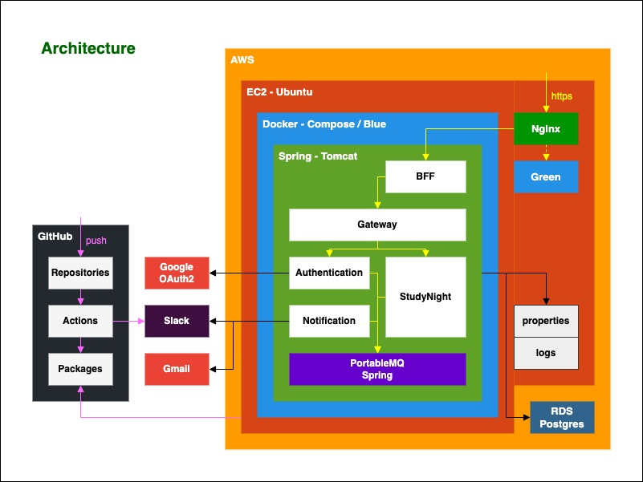

# StudyNight Backend

개발자 스터디 매칭 서비스

> [local](#local) / [stage](#stage)

---

## local

백엔드 개발 환경입니다. 데이터가 유지되지 않으며, 외부연동 기능이 동작하지 않습니다.

> BE - http://localhost:8080,
[API](http://localhost:8080/swagger-ui.html) /
[TEST](http://localhost:8080/reports/tests/test/index.html) /
[COVERAGE](http://localhost:8080/reports/jacoco/test/html/index.html)

`.env/local/docker-compose.yml`로 인프라 구성 후 `Java`로 실행합니다.

---

## stage

통합 테스트 환경입니다. 데이터는 `.env/stage/mount`에 저장되며 디렉토리 삭제 시 초기화됩니다.

> FE - n/a   
> BE - n/a

`.env/stage/run.sh`로 도커 이미지 `pull`, 프로퍼티 저장소 `clone`, 도커 컴포즈 `up`을 수행합니다.

> 파일의 위치로 이동 후 실행해야 합니다.  
> 프로퍼티 저장소 접근 권한이 필요합니다.  
> 환경변수 `$GITHUB_USERNAME`과 `$GITHUB_TOKEN`가 설정되어 있어야 합니다. [발급](https://github.com/settings/tokens)
